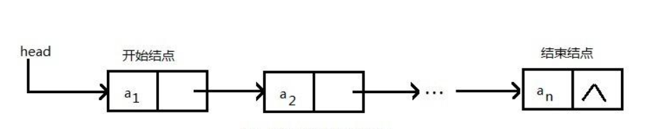
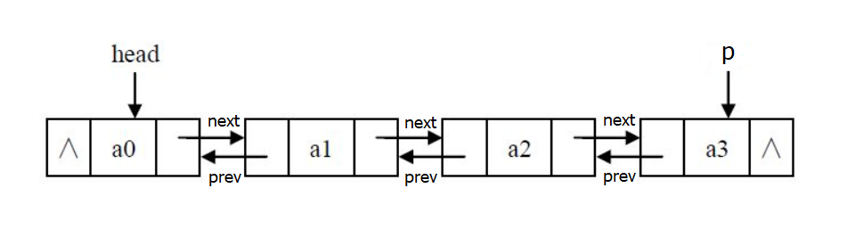

# 链表

> 链表是一种物理存储单元上非连续、非顺序的存储结构，数据元素的逻辑顺序是通过链表中的指针链接次序实现的。链表由一系列结点（链表中每一个元素称为结点）组成，结点可以在运行时动态生成。

## 1. 单向链表

> 单向链表（单链表）是链表的一种，其特点是链表的链接方向是单向的，对链表的访问要通过顺序读取从头部开始；链表是使用指针进行构造的列表；又称为结点列表，因为链表是由一个个结点组装起来的；其中每个结点都有指针成员变量指向列表中的下一个结点；列表是由结点构成，head指针指向第一个成为表头结点，而终止于最后一个指向nuLL的指针。

图示：

- [x] [单向链表实现](./single-link-list.js)

## 2. 双向链表

> 双向链表也叫双链表，是链表的一种，它的每个数据结点中都有两个指针，分别指向直接后继和直接前驱。所以，从双向链表中的任意一个结点开始，都可以很方便地访问它的前驱结点和后继结点。一般我们都构造双向循环链表。

图示：

- [x] [双向链表](./doubly-link-list.js)
