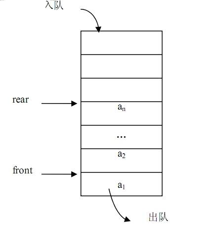

# 队列

> 队列（queue），是只允许在表的前端（front）进行删除操作，而在表的后端（rear）进行插入操作的线性表。进行插入操作的端称为队尾，进行删除操作的端称为队头。队列中没有元素时，称为空队列。在队列中插入一个队列元素称为入队，从队列中删除一个队列元素称为出队。因为队列只允许在一端插入，在另一端删除，只有最早进入队列的元素才能最先从队列中删除。先进先出（和栈相反）。

队列图示：

- [x] [使用数组模拟队列实现](./array-queue.js)
- [x] [链式队列实现](./link-queue.js)