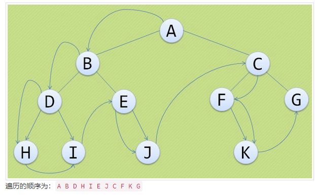
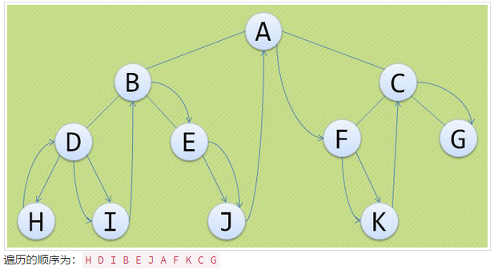
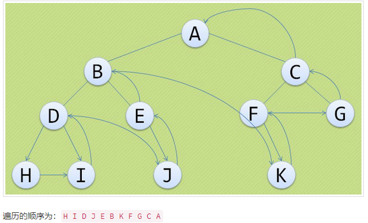

# 树

## 1. 二叉树

> 是一个有限元素的集合,该集合或者为空、或者由一个称为根的元素及两个不相交的、被分别称为左子树和右子树的二叉树组成。

- 性质1：二叉树第i层上的节点数目最多为2i-1(i≥1);
- 性质2：深度为k的二叉树至多有2k-1个结点(k≥1)。
- 性质3： 在任意-棵二叉树中，若叶子结点（即度为0的结点）的个数为n0，度为1的结点数为n1，度为2的结点数为n2，则n0=n2+1。

### 前序遍历

> 若二叉树为空，则空操作返回，否则先访问根结点，然后前序遍历左子树，再前序遍历右子树。

### 中序遍历

> 若树为空，则空操作返回，否则从根结点开始（注意并不是先访问根结点），中序遍历根结点的左子树，然后是访问根结点，最后中序遍历右子树。

### 后序遍历

> 若树为空，则空操作返回，否则从左到右先叶子后结点的方式遍历访问左右子树，最后访问根结点。

- [x] [二叉树构造和遍历](./binary-tree.js)